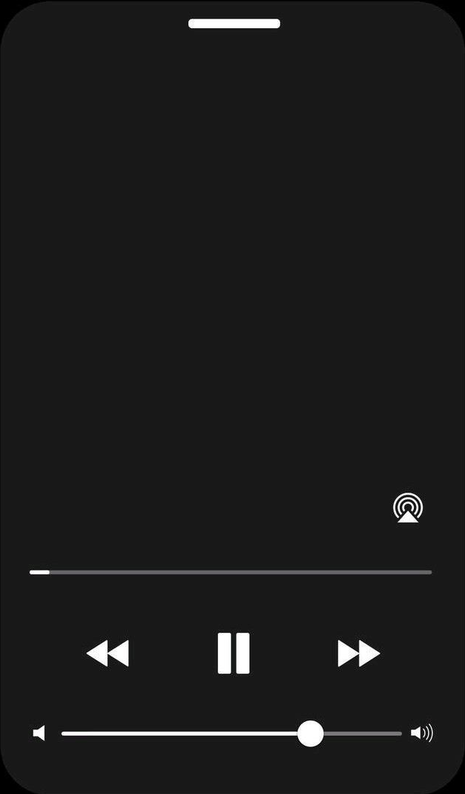
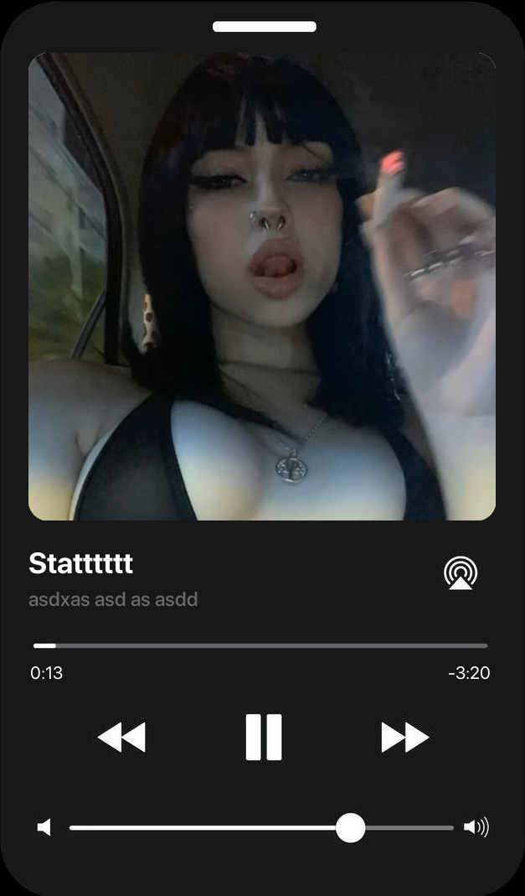

# 📱 iPhone Music Player Image Creator (CLI)

Generate realistic iPhone-style music player screenshots using your own album cover, track title, artist name, and timestamps.

This is a Python CLI tool built with **Pillow** that overlays album art and song information onto a predefined iPhone music player template.

---

## 🖼 Example

### Template


### Cover Used


### Generated Output


---

## ✨ Features

- Automatically resizes album cover to fit the template
- Adds rounded corners to album artwork
- Custom song title and artist name
- Custom playback start time and remaining time
- High-quality image resizing (LANCZOS resampling)
- Clean CLI interface using argparse

---

## 📦 Requirements

- Python 3.9+
- Pillow

Install dependency:

```bash
pip install pillow
````

## 🚀 Usage

```bash
python main.py \
  --title "Blinding Lights" \
  --artist "The Weeknd" \
  --start-time "1:12" \
  --remaining-time "2:34" \
  --cover "cover-3.png"
```

---

## 🛠 CLI Arguments

| Argument           | Description               |
| ------------------ | ------------------------- |
| `--title`          | Track title               |
| `--artist`         | Track artist              |
| `--start-time`     | Elapsed playback time     |
| `--remaining-time` | Remaining playback time   |
| `--cover`          | Path to album cover image |

---

## 📁 Project Structure

```
.
├── main.py
├── template.png
├── cover-3.png
├── output.png
└── README.md
```

---

## 🔤 Fonts Used

This project uses **SF Pro Display** fonts:

* SFPRODISPLAYBOLD.OTF
* SFPRODISPLAYMEDIUM.OTF
* SFPRODISPLAYREGULAR.OTF

Ensure these fonts are installed on your system or update the font paths inside `main.py` accordingly.

---

## 📌 Notes

* `template.png` must be present in the same directory.
* The generated image is saved as `output.png`.
* Rounded corners are dynamically applied to the album cover.
* You can modify font size and positioning inside the script to customize layout.

---
